# 발생 가능한 동시성 문제 및 제어 비교

## 1️⃣ 포인트 충전·사용

### 💥 발생할 수 있는 동시성 문제

- Lost Update
  : 사용자가 동시에 포인트를 사용하거나 충전하려 할 때, 사용자의 이전 변경 내용이 덮어씌워질 가능성이 있음

- Dirty Read
  : 포인트 차감 트랜잭션이 롤백될 경우, 사용자가 변경된 잔액을 잘못된 값으로 읽을 가능성이 있음

- Non-Repeatable Read
  : 사용자 포인트 잔액을 두 번 조회할 때, 그 사이에 포인트를 사용하면 값이 달라질 수 있음

### 📊 포인트 차감 동시성 테스트 결과

| 제어 방식                        | 테스트 결과 |  소요 시간 | Log                                                                                              | 구현 복잡도 |
|------------------------------|--------|-------:|--------------------------------------------------------------------------------------------------|--------|
| Serializable                 | ✅ 성공   | 116 ms | 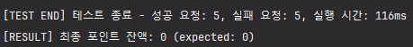                              | 보통     |
| No Lock                      | ❌ 실패   |  89 ms | 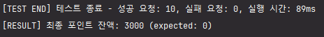                                        | 낮음     |
| Optimistic Lock (No Retry)   | ❌ 실패   | 128 ms | 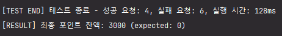      | 보통     |
| Optimistic Lock (With Retry) | ✅ 성공   | 293 ms | 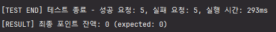 | 높음     |
| Pessimistic Lock             | ✅ 성공   |  77 ms | 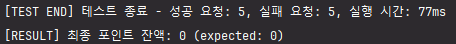                      | 보통     |
| Redis Lock                   | ✅ 성공   | 304 ms | 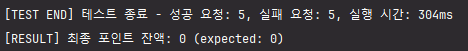                                  | 높음     |

---

## 2️⃣ 제품 재고 수정

### 💥 발생할 수 있는 동시성 문제

- Lost Update
  : 두 사용자가 동시에 같은 재고 수량을 차감하면, 한 사용자의 변경 사항이 덮어씌워질 수 있음

- Dirty Read
  : 한 트랜잭션이 커밋되지 않은 재고 데이터를 읽으면, 나중에 롤백될 경우 잘못된 데이터를 참조할 가능성이 있음

- Phantom Read
  : 재고 확인 시, 같은 조건의 조회 결과가 실행마다 달라질 수 있음 (예: 처음엔 "재고 있음", 두 번째 조회에서는 "재고 없음")

- Deadlock
  : 여러 사용자가 동시에 같은 상품 재고를 차감하려 할 때, 락이 충돌하면서 교착 상태에 빠질 가능성이 있음

### 📊 재고 차감 동시성 테스트 결과

| 제어 방식                        | 테스트 결과 |  소요 시간 | Log                                                                                               | 구현 복잡도 |
|------------------------------|--------|-------:|---------------------------------------------------------------------------------------------------|--------|
| Serializable                 | ✅ 성공   | 214 ms | 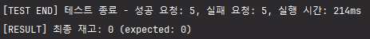                             | 보통     |
| No Lock                      | ❌ 실패   | 161 ms | 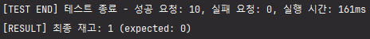                                       | 낮음     |
| Optimistic Lock (No Retry)   | ❌ 실패   | 324 ms | 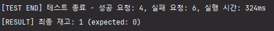     | 보통     |
| Optimistic Lock (With Retry) | ✅ 성공   | 445 ms | 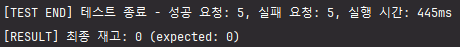 | 높음     |
| Pessimistic Lock             | ✅ 성공   | 251 ms | 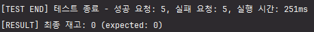                     | 보통     |
| Redis Lock                   | ✅ 성공   | 468 ms | 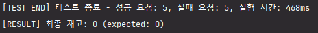                                 | 높음     |

---

## 3️⃣ 선착순 쿠폰 발급

### 💥 발생할 수 있는 동시성 문제

- Lost Update
  : 동시에 여러 사용자가 쿠폰을 발급받으려 하면, 일부 요청이 유실될 가능성이 있음

### 📊 쿠폰 수량 차감 동시성 테스트 결과

| 제어 방식                        | 테스트 결과 |  소요 시간 | Log                                                                                                        | 구현 복잡도 |
|------------------------------|--------|-------:|------------------------------------------------------------------------------------------------------------|--------|
| Serializable                 | ✅ 성공   | 208 ms | 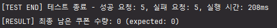                             | 보통     |
| No Lock                      | ❌ 실패   | 188 ms | 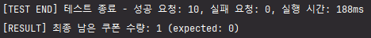                                       | 낮음     |
| Optimistic Lock (No Retry)   | ❌ 실패   | 189 ms | 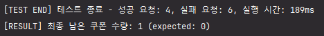     | 보통     |
| Optimistic Lock (With Retry) | ✅ 성공   | 397 ms | 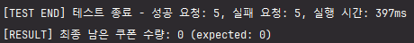 | 높음     |
| Pessimistic Lock             | ✅ 성공   | 250 ms | 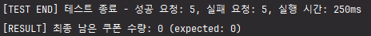                     | 보통     |
| Redis Lock                   | ✅ 성공   | 330 ms | 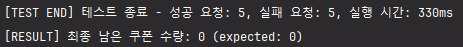                                 | 높음     |

---

### ⚖️ 동시성 문제 제어 방식 선택

**1. 동시성 문제를 해결 할 수 있어야 한다.**

- Serializable
- ~~No Lock~~ ❌ (동시성 문제 해결 불가)
- Optimistic Lock (No Retry)
- Optimistic Lock (With Retry)
- Pessimistic Lock
- Redis Lock

**2. 모든 요청이 성공 해야 한다**

- Serializable (트랜잭션 레벨 제어)
- ~~Optimistic Lock (No Retry)~~ ❌ (충돌 발생 가능성 높음)
- Optimistic Lock (With Retry) (충돌 시 재시도)
- Pessimistic Lock (즉시 락 적용)
- Redis Lock (분산 환경 지원)

**3. 성능 및 구현 복잡도 고려**

- ~~Serializable~~ ❌ (거의 대부분의 작업에 부하가 높음)
- ~~Optimistic Lock (With Retry)~~ ❌ (소요시간 오래걸림)
- Pessimistic Lock (소요시간 적게걸림)
- ~~Redis Lock (분산 환경 지원)~~ ❌ (소요시간 오래걸림, 구현 복잡도 높음)

**4. 최종 선택**

- ✅ **Pessimistic Lock 선택**
    - 비지니스 요구사항을 만족하는 동작을 함
    - 현재의 상황에서 구현복잡도가 낮고 성능이 양호 함