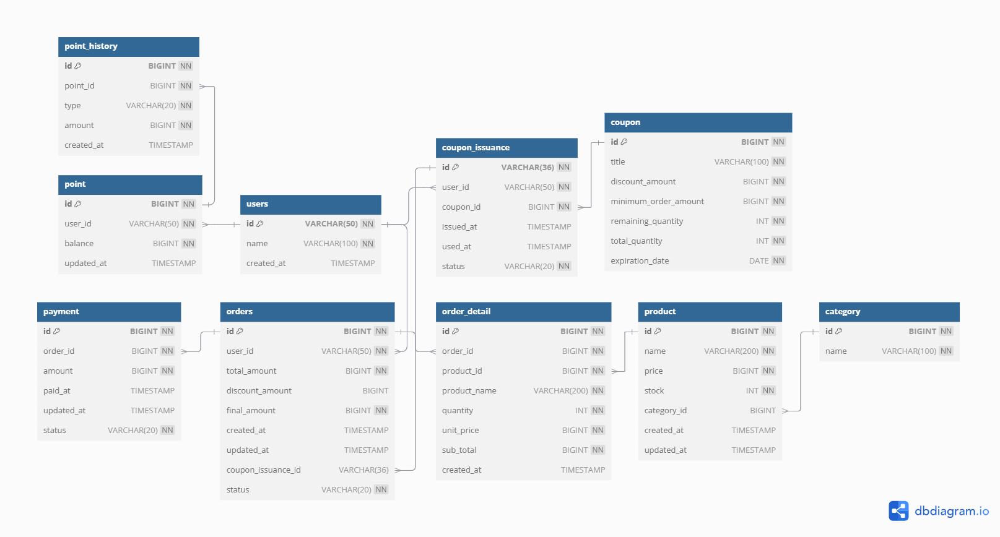

### 시나리오 선정

---

e-커머스 서비스 vs 콘서트 예약 서비스
: 이용 경험이 많아 도메인에 대한 이해도가 있는 e-커머스 서비스 선택

  

### MileStone

---

<table>
    <caption style="text-align: right;"><b>(단위: MD)</b></caption>
    <thead>
        <tr>
            <th colspan="4">3주차</th>
            <th colspan="2">4주차</th>
            <th colspan="2">5주차</th>
        </tr>
        <tr>
            <th>설계 및 문서 작성</th>
            <th>5</th>
            <th>Mock API 개발</th>
            <th>1</th>
            <th>구현</th>
            <th>6</th>
            <th>배포</th>
            <th>4</th>
        </tr>
    </thead>
    <tbody>
        <tr>
            <td>API Specification</td>
            <td>1</td>
            <td>8 개</td>
            <td>1</td>
            <td>환경 셋업(TestContainer, Docker)</td>
            <td>2</td>
            <td>튜닝 및 고도화</td>
            <td>2</td>
        </tr>
        <tr>
            <td>ERD</td>
            <td>1</td>
            <td rowspan="4"></td>
            <td rowspan="4"></td>
            <td >도메인 구현</td>
            <td>3</td>
            <td>PR문서 작성</td>
            <td>2</td>
        </tr>
        <tr>
            <td>시퀀스 다이어그램</td>
            <td>1</td>
            <td>Infra 구현</td>
            <td>1</td>
            <td rowspan="3"></td>
            <td rowspan="3"></td>
        </tr>
        <tr>
            <td>플로우 차트</td>
            <td>1</td>
            <td rowspan="2"></td>
            <td rowspan="2"></td>
        </tr>
        <tr>
            <td>도메인 객체 설계</td>
            <td>1</td>
        </tr>
    </tbody>
</table>

  

### 분석 자료

---

#### 요구사항 분석 및 정책 설정

<table>
    <thead>
        <tr>
            <th>기능</th>
            <th>정책</th>
        </tr>
    </thead>
    <tbody>
        <tr>
            <td rowspan="5"><strong>포인트 충전</strong></td>
            <td>포인트를 충전하기 위해서는 userId와 충전 금액을 포함해서 요청한다.</td>
        </tr>
        <tr><td>존재하지 않는 사용자의 포인트는 충전에 실패한다.</td></tr>
        <tr><td>1회에 1~100만 포인트까지 충전 가능하다.</td></tr>
        <tr><td>100만 포인트를 초과하는 충전은 포인트 충전에 실패한다.</td></tr>
        <tr><td>최대 보유 포인트는 1000만 포인트를 초과할 수 없다.</td></tr>
        <tr>
            <td rowspan="2"><strong>포인트 조회</strong></td>
            <td>포인트를 조회하려면 userId를 포함해서 요청해야 한다.</td>
        </tr>
        <tr><td>존재하지 않는 사용자의 포인트 조회는 실패한다.</td></tr>
        <tr>
            <td rowspan="3"><strong>상품 조회</strong></td>
            <td>사용자는 원하는 선택조건을 포함해서 요청할 수 있다.</td>
        </tr>
        <tr><td>존재하지 않는 카테고리의 상품정보를 요청하면 요청이 실패한다.</td></tr>
        <tr><td>상품정보가 존재하지 않을 시 빈 배열을 반환한다.</td></tr>
        <tr>
            <td><strong>인기 판매 상품 조회</strong></td>
            <td>인기 판매 상품을 최근 3일간 판매 데이터를 기준으로 한다.</td>
        </tr>
        <tr>
            <td rowspan="6"><strong>선착순 쿠폰 발급</strong></td>
            <td>선착순 쿠폰을 발급받기 위해서는 userId와 couponId를 포함해서 요청해야 한다.</td>
        </tr>
        <tr><td>쿠폰은 금액 할인 쿠폰만 있다.</td></tr>
        <tr><td>한 사용자는 각 couponId 별로 하나씩만 받을 수 있다.</td></tr>
        <tr><td>같은 couponId를 가진 쿠폰에 대해서 중복해서 발급 요청하면 요청은 실패한다.</td></tr>
        <tr><td>선착순 발급이 완료된 쿠폰을 발급 요청하면 요청이 실패한다.</td></tr>
        <tr><td>존재하지 않는 사용자의 쿠폰 발급 요청은 실패한다.</td></tr>
        <tr>
            <td rowspan="2"><strong>발급 받은 쿠폰 조회</strong></td>
            <td>사용자는 쿠폰을 조회하기 위해 userId를 포함해서 요청해야 한다.</td>
        </tr>
        <tr><td>사용자가 받은 쿠폰이 없을 경우 빈 배열을 반환한다.</td></tr>
        <tr>
            <td rowspan="5"><strong>주문</strong></td>
            <td>주문 시에는 userId와 상품ID, 주문 개수를 담은 배열을 포함해서 요청한다.</td>
        </tr>
        <tr><td>한 번에 최대 100가지의 상품을 주문할 수 있다.</td></tr>
        <tr><td>100개 이상의 상품을 포함한 주문은 실패한다.</td></tr>
        <tr><td>쿠폰 사용을 원할 시에는 couponIssuanceId를 함께 포함해서 요청한다.</td></tr>
        <tr><td>존재하지 않는 쿠폰을 포함해서 주문하는 경우 주문이 실패한다.</td></tr>
        <tr>
            <td rowspan="2"><strong>결제</strong></td>
            <td>결제를 위해서는 userId, orderId가 있어야 한다.</td>
        </tr>
        <tr><td>결제 시점에 보유한 포인트가 결제 금액보다 적으면 결제에 실패한다.</td></tr>
    </tbody>
</table>

  

#### ERD Diagram

| 테이블명                | 설명                                          |
|---------------------|---------------------------------------------|
| **user**            | - 사용자 기본 정보                                 |
| **point**           | - 사용자 ID, 포인트 잔액, 수정 일시                     |
| **point_history**   | - 포인트 충전/사용 내역                              |
| **coupon**          | - 쿠폰 틀   - 쿠폰의 정보, 잔여수량 등                |
| **coupon_issuance** | - 쿠폰 발급번호(고유번호)를 포함한 발급된 쿠폰의 정보             |
| **product**         | - 제품 기본 정보                                  |
| **order**           | - 주문 정보   - 주문자, 주문 금액, 쿠폰 적용 정보 등       |
| **order_detail**    | - 주문에 포함된 제품 상세 정보   - 주문 시의 제품 명, 제품 가격 |
| **payment**         | - 결제 정보   - 주문과 1:1 관계                   |

### 시퀀스 다이어그램

- Point
  
  
- Coupon
  
  
- Product
  
  
- Order & Payment
  
  

### API 명세서

- Point
  
- Coupon   
  
- Product   
  
- Order
  